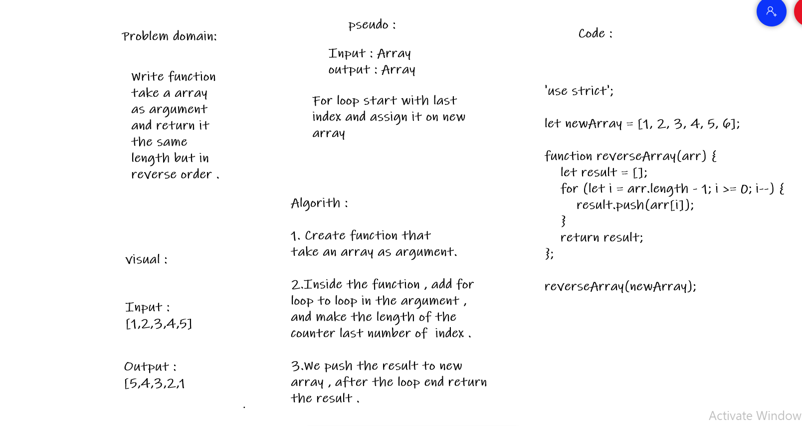

# Reverse an Array
###### Function take a array of items as an argument and will return a new array with same items and length but in reverse order.

## Challenge
###### Write a function called reverseArray , Without use any of the built-in methods available in JavaScript , return an array with elements in reversed order.

## Approach & Efficiency
###### As the challenge requirement , We can't use built-in methods , so we need to think in differnet way to solve this code challange. 

## Solution

