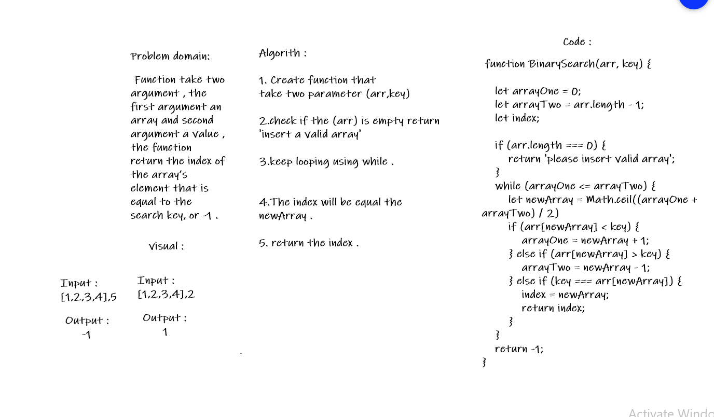

# Reverse an Array
###### Function take two argument , the first argument an array and second argument a value , the function return the index of the array’s element that is equal to the search key, or -1 . 

## Challenge
###### Write a function called BinarySearch , Without use any of the built-in methods available in JavaScript , return an array with elements in reversed order.

## Approach & Efficiency
###### As the challenge requirement , We can't use built-in methods , so we need to think in differnet way to solve this code challange. 

## Solution

