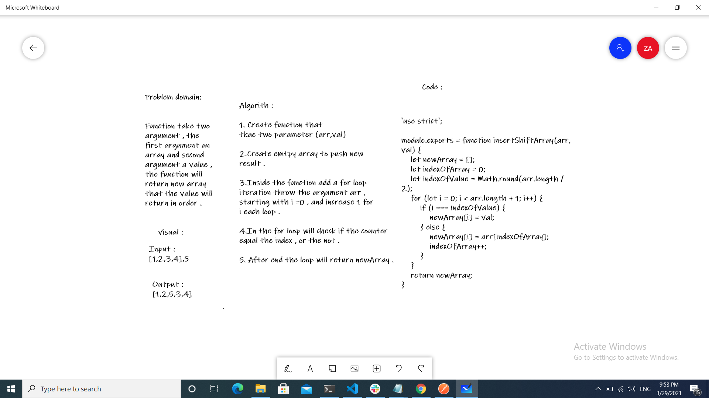

# Reverse an Array
###### Function take two argument , the first argument an array and second argument a value , the function will return new array that the value will return in order .

## Challenge
###### Write a function called insertShiftArray , which takes in an array and the value to be added, return an array with the new value added in order .

## Approach & Efficiency
###### As the challenge requirement , We can't use built-in methods , so we need to think in differnet way to solve this code challange. 

## Solution

