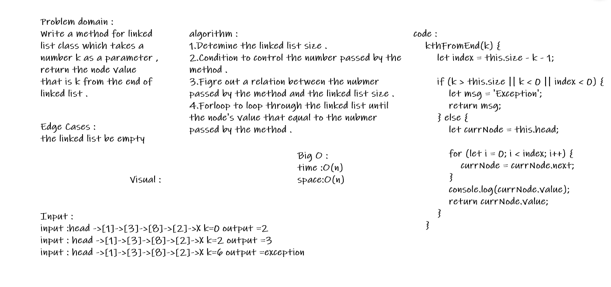

# Singly Linked List .
### Create methods for singly linked list . 

## Challenge : 
#### To create a Linked List class that have three methods insert , includes , and to string , append , insert before , insert after . 

## Approach & Efficiency :
### Insert : Insert a new value to the linked list 
### The big O : space O(1) || time O(1).

### Includes : Accept and check if the value was exist in the linked list . 
### The big O :  space O(1) || time O(n).

### tostring : Take an arguments and returns a sting replace all values in linked list formatted as : "{ a } -> { b } -> { c } -> NULL"
### The big O : space O(1)|| time O(n) 

### Append : which adds a new node with the given value to the end of the list

### insert before : which add a new node with the given newValue immediately before the first value node.

### insert after : which add a new node with the given newValue immediately after the first value node 

### kth From End :Write a method for the Linked List class which takes a number, k, as a parameter. Return the node’s value that is k from the end of the linked list.

# API : 
### We have three method : 
#### Insert : Accept a node as an argument and insert the node to first of linked list .
#### Includes : Accept a node as an argument and return boolean value , return true if the value exist or false if not exist . 
#### Tostring : Accept no argument and return a string representing all values in linked list like : "{ a } -> { b } -> { c } -> NULL"

