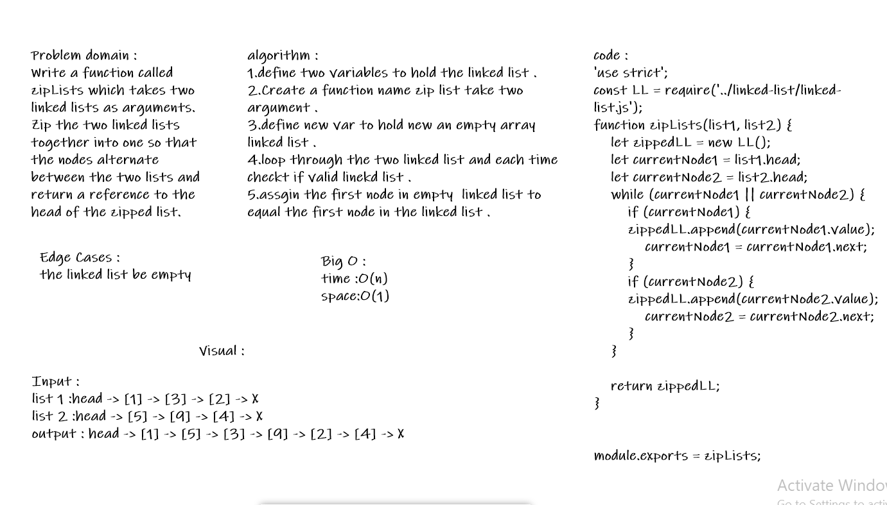

# Zip Lists
###### Zip the two linked lists together into one so that the nodes alternate between the two lists and return a reference to the head of the zipped list.

## Challenge
###### Write a function called zipLists which takes two linked lists as arguments. Zip the two linked lists together into one so that the nodes alternate between the two lists and return a reference to the head of the zipped list. Try and keep additional space down to O(1). You have access to the Node class and all the properties on the Linked List class as well as the methods created in previous challenges

## Approach & Efficiency
###### A function name zipLists take the length of the largest length between the two argument list, defiend a new list from the class LinkedList, then add a index for each list increase by one each time append one it value on the new list, add loop from zero to largest length then add two if statements for each two argument lists if the index less than its length, take the node value of that index from kthFromEnd method by making the index in reverse and append it to the new list, during this sequence will store the node in the new list as needed, then after the loop end will return the new list methos toString to have a string with all node.

## Solution

