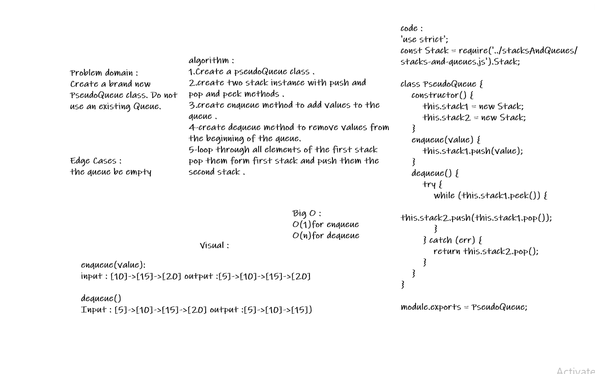

# QUEUES WITH STACKS: 
### Implement a Queue using two stacks.

# Challenge :
##### Create a brand new PseudoQueue class. Do not use an existing Queue. Instead, this PseudoQueue class will implement our standard queue interface (the two methods listed below), but will internally only utilize 2 Stack objects. Ensure that you create your class with the following methods:

##### enqueue(value) which inserts value into the PseudoQueue, using a first-in, first-out approach.
##### dequeue() which extracts a value from the PseudoQueue, using a first-in, first-out approach.
##### The Stack instances have only push, pop, and peek methods. You should use your own Stack implementation. Instantiate these Stack objects in your PseudoQueue constructor.

## Approach & Efficiency :
##### Time O(n) Space O(1) The approach was to create two stacks and treat the values within them as though they were in a queue. Taking the first value in stack1 and pushing it into stack2 resulting in the FIFO method.

## API :
##### enqueue(value) which inserts value into the PseudoQueue, using a first-in, first-out approach. dequeue() which extracts a value from the PseudoQueue, using a first-in, first-out approach.

### WhiteBoard :

