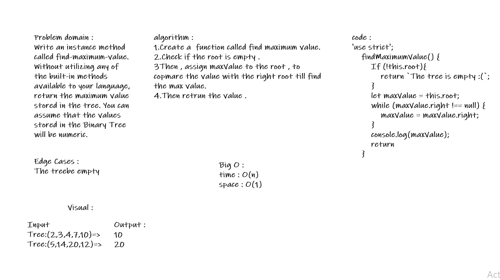

# Trees :

# Challenge :
###### Create a Node class that has properties for the value stored in the node, the left child node, and the right child node.
###### Create a BinaryTree class
###### Define a method for each of the depth first traversals called preOrder, inOrder, and postOrder which returns an array of the values, ordered appropriately.
###### Create a BinarySearchTree class
###### Define a method named add that accepts a value, and adds a new node with that value in the correct location in the binary search tree.
###### Define a method named contains that accepts a value, and returns a boolean indicating whether or not the value is in the tree at least once.

# Approach & Efficiency :

### Big O :
### BinaryTree: Space:O(h) Time:O(n).
### BinarySearchTree: Space:O(h) Time:O(n).

# API: 
#### BinaryTree: Define a method for each of the depth first traversals called preOrder, inOrder, and postOrder which returns an array of the values, ordered appropriately.
#### BinarySearchTree : Define a method named add that accepts a value, and adds a new node with that value in the correct location in the binary search tree , Define a method named contains that accepts a value, and returns a boolean indicating whether or not the value is in the tree at least once.
#### getmax : Retrun the max value in tree .

# Solution : 

