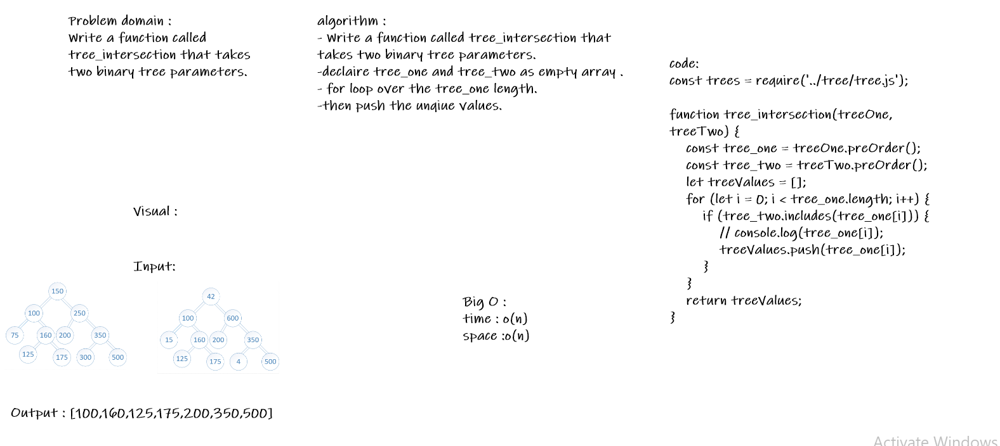

# Challenge Summary:
#### Write a function called tree_intersection that takes two binary tree parameters.
#### Without utilizing any of the built-in library methods available to your language, return a set of values found in both trees.

# Approach & Efficiency : 
### big O : 
#### Time : O(n)
#### Space : O(n)

# Solution :
